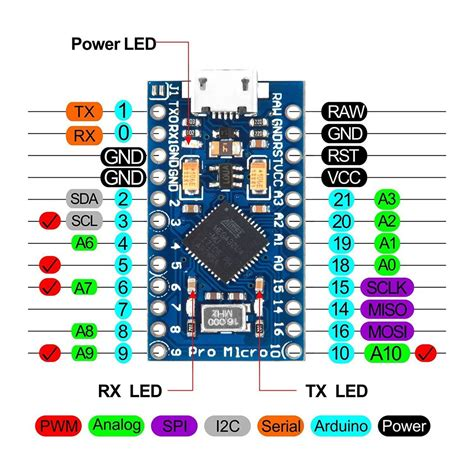
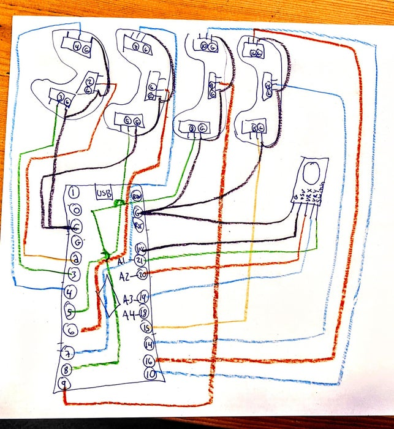

# Azeron-Clone-Controller

Original code by AnonEngineering
> Sample code for a 3D printed clone of the Azeron Game Pad controller. Runs on Pro Micro  ATmega32U4, emulating a HID keyboard over USB.
>
> Comment or uncomment #define DEBUG on line 10 to use Serial or Keyboard modes.

Updated code as follows:
* removed serial debugging for readability
* changed pinout configuration (found some differences with Arduino Pro Micro pinout reference on Analog pins)
* implemented 8-ways joystick WASD

Wiring is considered according to AnonEngineering build scheme (see [Instructables](https://www.instructables.com/Azeron-Game-Pad-DIY-Under-35/))

Check your pins and test assignments. Probably it is needed to tweak joystick directions (just change the reference to up, down, left and right variables)

`// Switch pins, {PIN, KEY, False}`
`// generic map`
`dKey dSwitch[] = {`
`    {3, '4', false}, // near little finger`
`    {2, KEY_ESC, false}, // mid little finger`
`    {4, 'z', false}, // far little finger`
`    {5, '3', false}, // near ring finger`
`    {6, 'x', false}, // mid ring finger`
`    {7, 'c', false}, // far ring finger`
`    {8, '2', false}, // near middle finger`
`    {9, 'q', false}, // mid middle finger`
`    {10, KEY_LEFT_CTRL, false}, // far middle finger`
`    {15, '1', false}, // near forefinger`
`    {14, 'e', false}, // mid forefinger`
`    {16, KEY_LEFT_SHIFT, false}, //far forefinger`
`    {21, ' ', false}, // Pin 19 = A1 // Joystick btn`
`};`
`// D-pad: UP = w, RIGHT = d, DOWN = s, LEFT = a, DPadNone is "center value"`
`const char dPadUp = 'w';`
`const char dPadRt = 'd';`
`const char dPadDn = 's';`
`const char dPadLt = 'a';`
`const char dPadNone = '0';`

